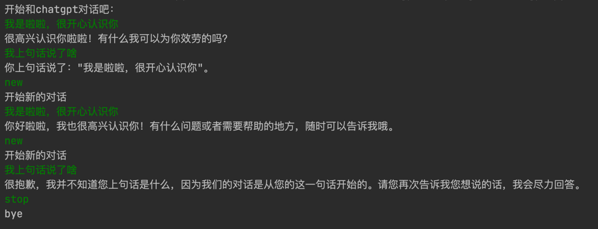

# chatgpt-Playwright

- 2_chatgpt.py

针对chatgpt的网页，使用Playwright进行的模拟交互，采用terminal方式进行对话，对话截图如下：


指令说明:
new：开始新的对话
stop：停止程序

由于openai只针对部分地区开放，所以需要做好代理，可以修改代码里面的代理为自己的：
```angular2html
launch_data_dict = {
    "headless": False,
    "proxy": {"server": "http://127.0.0.1:7892"}
}
```

建议将个人账号信息保存到env文件中：格式如下：
```angular2html
{"openai_account": "xxx"}
{"openai_passwd": "xxx"}
```